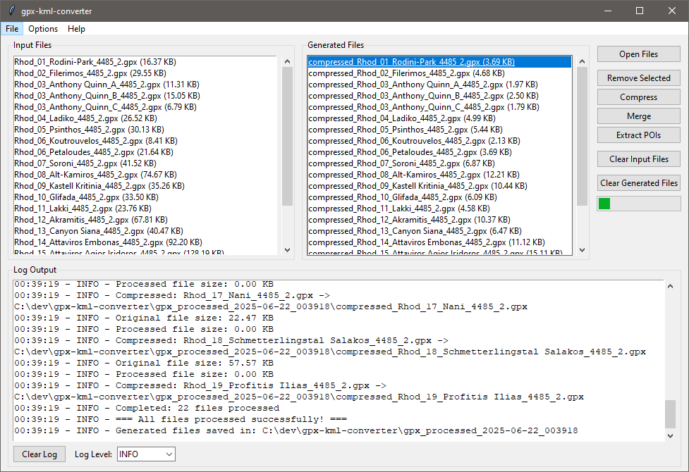
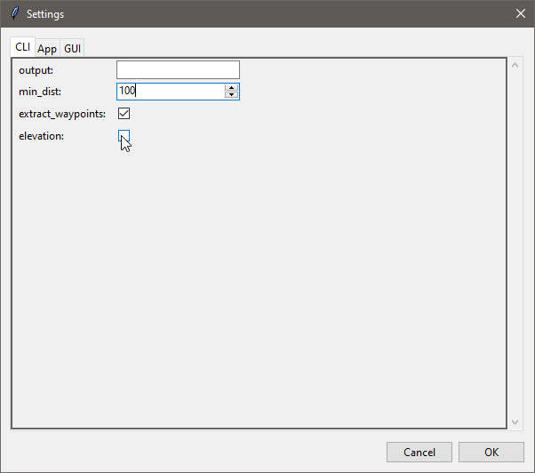

# Graphical user interface (GUI)

Once the GUI is launched, you can:

1. **Open Files:** Add GPX, KML, or ZIP files to the input list. Newly opened
   files are selected, and **Select All Inputs** selects the entire workspace.
2. **Choose the processing scope:** Select one or more inputs in the list.
   Processing an empty selection uses all loaded inputs.
3. **Choose a processing mode:** Use **Compress Files**, **Merge Files**, or
   **Extract POIs from Tracks**.
4. **Inspect results:** Processed files appear in **Generated Files**. Double-
   click a result to open it in the system's default application.
5. **Continue processing:** Select generated results and choose **Use Selected
   Results as Inputs**. Results stay in the generated list and are added to the
   input list for another processing step.
6. **Monitor progress:** Observe the progress indicator and log output.

## Main Window Overview

## Settings Dialog

